# AI-Powered Personal Diet Planner with Cloud Storage

[](https://github.com/SNischayPrasad/AI-Powered-Personal-Diet-Planner-with-Cloud-Storage/actions/workflows/ci.yml)


A cloud-based, AI-powered personal diet planning application with authentication,
personalised recommendations, a cloud database, object storage and a scalable deployment
architecture. It is a Cloud Computing course project, built to industry standards and able
to run **entirely free**: locally with one command, or on free cloud tiers.

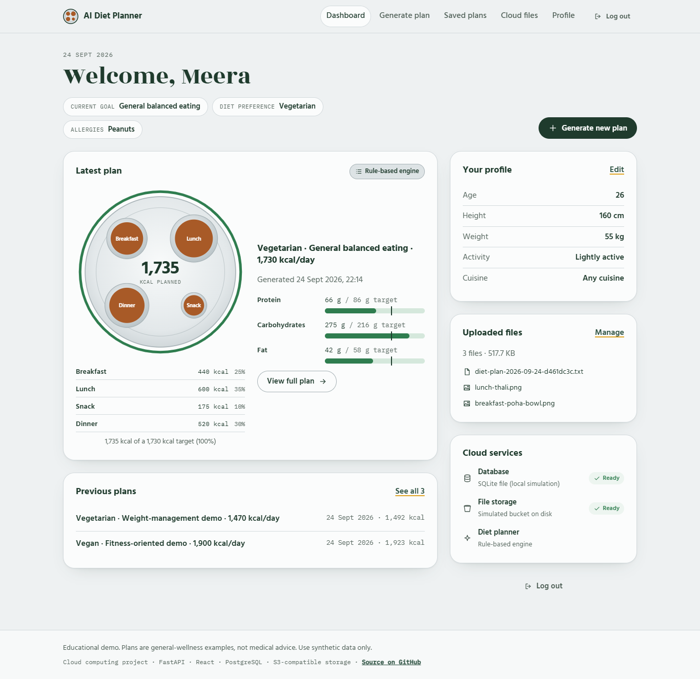

> **Disclaimer:** generated plans are educational, general-wellness examples. They are
> **not** medical or clinical nutrition advice. All data in this project is synthetic.

---

## Contents

[Overview](#overview) · [Problem statement](#problem-statement) · [Objectives](#objectives) ·
[Features](#features) · [Cloud computing concepts](#cloud-computing-concepts) ·
[Architecture](#architecture) · [Technology stack](#technology-stack) ·
[AI recommendation engine](#ai-recommendation-engine) · [Authentication](#authentication) ·
[Database](#database) · [Cloud storage](#cloud-storage) · [REST APIs](#rest-apis) ·
[Folder structure](#folder-structure) · [Installation](#installation) ·
[Environment variables](#environment-variables) · [Local setup](#local-setup) ·
[Running the application](#running-the-application) · [Cloud deployment](#cloud-deployment) ·
[Testing](#testing) · [Security](#security) · [Scalability](#scalability) ·
[Screenshots](#screenshots) · [Results](#results) · [Limitations](#limitations) ·
[Future improvements](#future-improvements) · [Learning outcomes](#learning-outcomes) ·
[Disclaimer](#disclaimer) · [Author](#author)

Full documentation (20 chapters, including interview preparation) is in [`docs/`](docs/README.md).

## Overview

A user signs up, enters a demo profile (age, height, weight, activity level, dietary
preference, goal and allergies), and gets a personalised day of meals: breakfast, lunch,
snack and dinner, with calories, macros, a hydration reminder and the reasoning behind each
dish. Plans are saved in a **cloud database** and can be reopened from any device. Meal
photos and plan exports are kept in **cloud object storage**.

Plans come from a transparent **rule-based recommendation engine**, or optionally from an
**LLM** (Claude or any OpenAI-compatible API). Every AI answer is checked against the user's
diet, allergens and calorie target. If the AI fails or breaks a rule, the app falls back to
the rule-based engine automatically, so it always works without a paid API key.

## Problem statement

Generic diet charts ignore a person's body, activity, food preferences and allergies, and
paper or single-device notes get lost. Students and busy professionals need a quick,
personalised starting point for balanced eating that they can reach from their phone and
laptop alike. It also has to keep each person's data private and hold up as more people use
it.

## Objectives

1. Show the core cloud computing ideas end to end: hosted app, managed database, object
   storage, stateless API, secrets in the environment, health checks, logs and metrics, CI/CD.
2. Generate personalised, explainable plans with a safe AI integration that never blocks the
   user.
3. Keep every user's data isolated and secure by design.
4. Stay free to run: local simulation first, with free-tier and AWS deployment paths.
5. Be readable and testable: modular code, 297 automated backend tests, and documentation a
   beginner can follow.

## Features

| Area | What you can do |
|---|---|
| Accounts | Register, log in, log out (the token is revoked server-side), protected pages |
| Profile | Name, age, sex, height, weight, activity level, diet (vegetarian / vegan / general), goal (balanced / weight-management demo / fitness demo), allergies, cuisine |
| Diet plans | Breakfast, lunch, snack and dinner with portions, ingredients, calories, protein, carbs, fat and fibre, plus a "why this dish" note; daily nutrition summary vs target; hydration reminder; tips |
| AI | Rule-based engine by default; optional Claude or OpenAI-compatible LLM with validation and automatic fallback; each plan shows which engine made it and why |
| Saved plans | List, open, delete; per-plan overrides (e.g. try vegan once) without changing the profile |
| Cloud storage | Upload meal images (JPEG/PNG/WebP) and PDFs, list, preview, download, delete; save a plan to storage as JSON or text; export a plan |
| Dashboard | Welcome, current goal and diet, latest plan, previous plans, uploaded files, live cloud status |
| Operations | Liveness and readiness probes, Prometheus-style metrics, request IDs, JSON logs, rate limiting, security headers |

## Cloud computing concepts

Each concept maps to a concrete place in the code. There is a longer walkthrough in
[docs/03-cloud-concepts.md](docs/03-cloud-concepts.md).

| Concept | Where it appears |
|---|---|
| SaaS | The finished app: users only need a browser |
| PaaS | Render / Vercel run the container or function; we never manage servers |
| IaaS | Approach B on AWS: VPC, subnets, security groups, ECS tasks ([docs/15](docs/15-cloud-deployment.md)) |
| Cloud database | `DATABASE_URL` → PostgreSQL on Neon / Supabase / RDS ([`cloud/database_service.py`](cloud/database_service.py)) |
| Object storage | `StorageService` → S3 / Supabase Storage / R2 / RustFS ([`cloud/storage_service.py`](cloud/storage_service.py)) |
| REST API, client-server | FastAPI routes under `/api` ([`backend/routes/`](backend/routes)), React client |
| Authentication | bcrypt + JWT + server-side logout ([`backend/utils/security.py`](backend/utils/security.py)) |
| Serverless | Vercel Python function ([`api/index.py`](api/index.py)) |
| Scalability, elasticity | Stateless API (JWT, no sessions): add instances freely; ECS auto scaling |
| Availability | Readiness probe drives load-balancer health checks; degraded mode on database outage |
| Load balancing, API gateway | Render / Vercel edge, AWS ALB; one `/api` entry point |
| Environment variables, secrets | [`backend/config.py`](backend/config.py), [`.env.example`](.env.example), Render `generateValue`, AWS Secrets Manager |
| Logging, monitoring | JSON logs with request IDs, `/api/metrics`, health endpoints |
| Deployment, CI/CD | [`Dockerfile`](Dockerfile), [`render.yaml`](render.yaml), [`vercel.json`](vercel.json), [GitHub Actions](.github/workflows/ci.yml) |

## Architecture

```text
 Browser (React SPA)
      │  HTTPS · JSON · Authorization: Bearer <JWT>
      ▼
 FastAPI REST API  ──  middleware: request ID · security headers · CORS · metrics · rate limits
      │
      ├── Auth service ─────────── bcrypt hashes · signed JWTs · revoked-token list
      ├── Profile / Plan services ─ AI planner ──► LLM provider (optional)
      │                                  │ fails / invalid
      │                                  └──────► rule-based engine (always available)
      ├── Cloud database ────────── SQLite (local) | PostgreSQL (Neon / Supabase / RDS)
      └── Object storage ────────── folder (local) | S3 API (S3 / Supabase / R2 / RustFS)
```

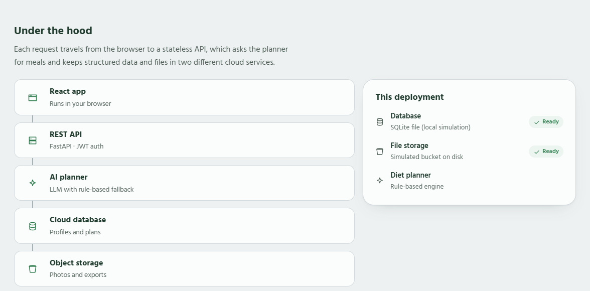

Request flow for "Generate plan": the browser sends the JWT, and the API verifies its
signature and expiry and checks that it wasn't revoked. It loads *only that user's* profile,
computes the calorie target (Mifflin-St Jeor → activity → goal), then asks the AI planner.
The planner returns a validated plan or falls back to the rule engine. The plan is saved to
the database with its provenance, and the React app renders it as a thali. Details in
[docs/05-architecture.md](docs/05-architecture.md).

## Technology stack

| Layer | Local (free) | Cloud |
|---|---|---|
| Frontend | React 19 + Vite, React Router | Same build, served by the API container or Vercel CDN |
| Backend | Python 3.11+ · FastAPI · Pydantic · Uvicorn | Docker on Render / AWS ECS Fargate, or a Vercel function |
| Database | SQLite via SQLAlchemy 2 | PostgreSQL (Neon, Supabase, AWS RDS) |
| Object storage | Folder "bucket", or RustFS in Docker | AWS S3, Supabase Storage, Cloudflare R2 (via boto3) |
| Auth | bcrypt, PyJWT (HS256) | Same; secret from the platform's secret store |
| AI | Rule-based engine + 65-dish dataset | + Claude (Anthropic SDK) or OpenAI-compatible (Gemini, Groq, Ollama) |
| Quality | pytest, moto, Vitest, ruff (incl. security rules) | GitHub Actions: SQLite + PostgreSQL + Docker full stack |

Three alternative stacks (beginner, recommended, advanced) are compared in
[docs/04-technology-options.md](docs/04-technology-options.md).

## AI recommendation engine

- **Nutrition maths** ([`ai_engine/nutrition.py`](ai_engine/nutrition.py)): Mifflin-St Jeor
  BMR × activity factor → goal adjustment (−15% weight management, +10% fitness), clamped
  to 1,200–4,000 kcal. Macro split per goal, per-meal budgets (25/35/10/30%), and water at
  about 35 ml/kg.
- **Version A: rule-based** ([`ai_engine/diet_engine.py`](ai_engine/diet_engine.py)): filter
  the 65-dish dataset by diet, allergens and cuisine. Scale portions in quarter servings
  toward each meal's budget, score by closeness plus a goal bonus, and pick among the top 3
  for variety.
- **Version B: LLM** ([`ai_engine/llm_providers.py`](ai_engine/llm_providers.py)): only
  enumerated preferences and computed targets are sent. No name, email or body measurements
  leave the server, and users cannot inject free text into the prompt. The answer must match
  a JSON schema.
- **Guardrails and fallback** ([`ai_engine/validation.py`](ai_engine/validation.py),
  [`ai_engine/planner.py`](ai_engine/planner.py)): every AI answer is checked for structure,
  forbidden ingredients, allergens, macro consistency and a day total within ±20% of target.
  Timeouts, rate limits, network or auth errors, refusals and invalid answers all fall back to
  the rule engine, and the reason is stored on the plan.

More in [docs/07-ai-engine.md](docs/07-ai-engine.md).

## Authentication

Passwords are hashed with **bcrypt** (12 rounds) and never stored or returned. Login returns
a **JWT** signed with HMAC-SHA256, carrying `sub`, `jti`, `iat`, `exp` and `type` claims. The
frontend sends it as `Authorization: Bearer …`. **Logout** adds the token's `jti` to a
revoked-tokens table, so a stolen token stops working immediately. Every data query filters
by the authenticated user's ID, and other users' IDs return **404** (not 403), so nothing
leaks about what exists. See [docs/09-authentication.md](docs/09-authentication.md).

## Database

Four tables: `users` (account and profile), `diet_plans` (meals as JSON documents, nutrition
summary and provenance), `user_files` (metadata for objects in storage) and `revoked_tokens`.
Primary keys are UUIDs, so they can't be guessed. User-owned rows have a `user_id` foreign
key with `ON DELETE CASCADE`, timestamps are UTC, and there is an index on
`(user_id, created_at)` for the "my plans, newest first" query. The same schema runs on SQLite
and PostgreSQL. ER diagram in [docs/06-database-design.md](docs/06-database-design.md).

## Cloud storage

**Database vs object storage:** the database holds structured, queryable records (who, what,
when). The object store holds the bytes: images, PDFs and exported plans. Each file's
metadata row points to its object key `users/<user-id>/<folder>/<uuid>.<ext>`.

Uploads are checked by **magic bytes** (not the file name), size-limited (4 MB), and capped
per user (50 files). If the metadata write fails after the upload, the object is deleted
again, so no orphans are left behind. Buckets stay private: downloads go through the API
after an ownership check. See [docs/08-cloud-storage.md](docs/08-cloud-storage.md).

## REST APIs

All under `/api`. Interactive docs at `/api/docs` (Swagger UI) and `/api/redoc`.

| Method | Path | Auth | Purpose |
|---|---|---|---|
| POST | `/register` | – | Create account → 201 + JWT |
| POST | `/login` | – | Log in → 200 + JWT |
| POST | `/logout` | ✔ | Revoke the current token |
| GET / PUT | `/profile` | ✔ | Read / update my profile |
| POST | `/generate-plan` | ✔ | Generate and save a plan (optional one-off overrides) |
| GET | `/plans` · `/plans/{id}` | ✔ | List my plans (newest first) · one plan |
| DELETE | `/plans/{id}` | ✔ | Delete my plan |
| GET | `/plans/{id}/export?format=json\|txt` | ✔ | Download a plan |
| POST | `/plans/{id}/save-to-cloud?format=json\|txt` | ✔ | Store a plan export in object storage |
| POST | `/upload` | ✔ | Upload a meal image or PDF (multipart) |
| GET | `/files` · `/files/{id}/download` | ✔ | List my files · download one |
| DELETE | `/files/{id}` | ✔ | Delete a file (object and metadata) |
| GET | `/health` · `/health/ready` · `/system/status` · `/metrics` | – | Liveness, readiness, providers, metrics |

Errors always look like `{"error": {"code": "not_found", "message": "…", "request_id": "…"}}`.
Full reference with status codes in [docs/11-api-reference.md](docs/11-api-reference.md).

## Folder structure

```text
├── frontend/            React app: pages/, components/, services/ (API client), context/, hooks/, styles/
├── backend/             FastAPI app: app.py, config.py, routes/, services/, models/, utils/
├── ai_engine/           nutrition.py, diet_engine.py, food_data.json, prompts.py, validation.py, llm_providers.py, planner.py
├── cloud/               database_service.py (SQLAlchemy), storage_service.py (local / S3)
├── api/index.py         Vercel serverless entry point
├── tests/               297 pytest tests (unit, API, isolation, failure handling, deployment)
├── scripts/             smoke_test.py, seed_demo_data.py, capture_screenshots.py
├── sample_data/         synthetic demo users, sample images, sample plan exports
├── screenshots/         README images
├── docs/                20 chapters of documentation
├── Dockerfile · docker-compose.yml · render.yaml · vercel.json
├── requirements.txt · requirements-dev.txt · pyproject.toml
└── .env.example · .gitignore · LICENSE · SECURITY.md
```

Every file is explained in [docs/12-folder-structure.md](docs/12-folder-structure.md).

## Installation

Prerequisites: **Python 3.11+**, **Node.js 20.19+** (22 recommended), **Git**. Docker Desktop
is optional.

```bash
git clone https://github.com/SNischayPrasad/AI-Powered-Personal-Diet-Planner-with-Cloud-Storage.git
cd AI-Powered-Personal-Diet-Planner-with-Cloud-Storage
python -m venv .venv
```

Activate the environment. On Windows (PowerShell):

```powershell
.venv\Scripts\Activate.ps1
```

On macOS / Linux:

```bash
source .venv/bin/activate
```

Then install the dependencies:

```bash
pip install -r requirements-dev.txt
npm --prefix frontend ci
```

## Environment variables

Copy [`.env.example`](.env.example) to `.env` (`copy .env.example .env` on Windows). Every
value has a safe local default, so the app runs with an empty `.env`. The ones that matter:

| Variable | Default | Purpose |
|---|---|---|
| `JWT_SECRET_KEY` | temporary random key (dev only) | Token signing secret; **required** (32+ chars) in production |
| `DATABASE_URL` | `sqlite:///./data/diet_planner.db` | Switch to PostgreSQL in the cloud |
| `STORAGE_PROVIDER` | `local` | `s3` for S3 / Supabase Storage / R2 / RustFS (`S3_*` settings) |
| `AI_PROVIDER` | `rule_based` | `anthropic` (+ `ANTHROPIC_API_KEY`) or `openai_compatible` (+ `OPENAI_COMPAT_*`) |
| `CORS_ORIGINS` | `http://localhost:5173,…` | Allowed browser origins |
| `LOG_FORMAT` | `text` | `json` in the cloud |

Secrets are never committed: `.env` is gitignored, and CI runs `ruff`'s security rules.

## Local setup

The whole cloud is simulated locally: SQLite stands in for the managed database and a folder
for the bucket. The step-by-step guide (15 steps, Windows and macOS/Linux commands, including
how to inspect the stored data) is in [docs/14-local-setup.md](docs/14-local-setup.md).

To simulate the cloud more closely with **PostgreSQL + S3-compatible storage** in Docker:

```bash
docker compose up -d postgres s3 s3-init
```

## Running the application

Terminal 1 (API, from the project root with the virtual environment active):

```bash
uvicorn backend.app:app --reload
```

Terminal 2 (frontend):

```bash
npm --prefix frontend run dev
```

Open **http://localhost:5173**. Vite forwards `/api` to the API on port 8000, and the API
docs are at http://localhost:8000/api/docs. Optionally load three synthetic demo users:

```bash
python scripts/seed_demo_data.py
```

Or run the production image exactly as it deploys (frontend and API on one port):

```bash
docker compose --profile app up --build
```

## Cloud deployment

| | Approach A: free tier | Approach B: AWS |
|---|---|---|
| App | Render web service from the `Dockerfile` ([`render.yaml`](render.yaml)), or Vercel ([`vercel.json`](vercel.json)) | ECS Fargate behind an ALB, image in ECR |
| Database | Neon / Supabase PostgreSQL | RDS PostgreSQL in private subnets |
| Storage | Supabase Storage / Cloudflare R2 | S3 private bucket + IAM task role |
| Secrets | Dashboard env vars (JWT generated by Render) | Secrets Manager |
| Monitoring | Platform logs + `/api/metrics` | CloudWatch Logs and alarms |

Step-by-step instructions, Azure and GCP equivalents, and troubleshooting are in
[docs/15-cloud-deployment.md](docs/15-cloud-deployment.md). After any deploy:

```bash
python scripts/smoke_test.py --base-url https://your-app.example.com
```

## Testing

| Suite | Count | Notes |
|---|---|---|
| Backend (pytest) | 297 tests, 97% coverage | Unit, API, user isolation, AI fallback, failure injection, S3 via `moto`, deployment config |
| Frontend (Vitest) | 31 tests | API client, formatting, thali geometry |
| Smoke (end to end) | 28 checks | The full user journey against any running deployment |
| CI | 6 jobs | Python 3.11 and 3.13, PostgreSQL, frontend build, smoke, Docker full stack |

All 20 required test cases (TC-01 … TC-20), with inputs, expected and actual results, are
in [docs/16-testing.md](docs/16-testing.md).

```bash
pytest               # backend
ruff check .         # lint + security rules
npm --prefix frontend test
```

## Security

- bcrypt password hashing, a password policy, and the same error for a wrong password or an
  unknown email (no account enumeration)
- Signed, expiring JWTs with server-side revocation; production refuses weak secrets
- Per-user authorization on every query; UUIDs; 404 for other users' IDs (TC-18: 11 tests)
- Strict input validation (Pydantic), magic-byte file checks, size limits, quotas
- Rate limiting on login, registration and plan generation (429 + `Retry-After`)
- CORS allow-list, CSP, HSTS, `X-Frame-Options`, `nosniff`, `no-store` for API responses
- Secrets only in environment variables; private buckets; non-root container
- AI data minimisation (no personal data in prompts) and output validation

Details and common student mistakes: [docs/17-security.md](docs/17-security.md) ·
policy: [SECURITY.md](SECURITY.md).

## Scalability

The API is **stateless**: identity travels in the JWT and data lives in managed services, so
it scales horizontally behind a load balancer. [docs/18-scalability.md](docs/18-scalability.md)
walks through what changes at 10, 1,000 and 100,000 users: autoscaling, CDN for the static
build, connection pooling and read replicas, caching, queues for AI generation and
presigned URLs for storage.

## Screenshots

| | |
|---|---|
| 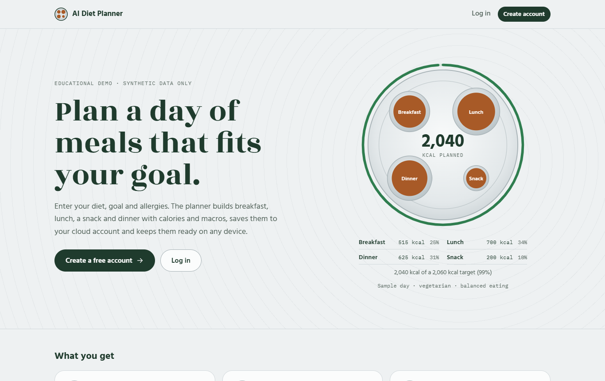 Landing page | 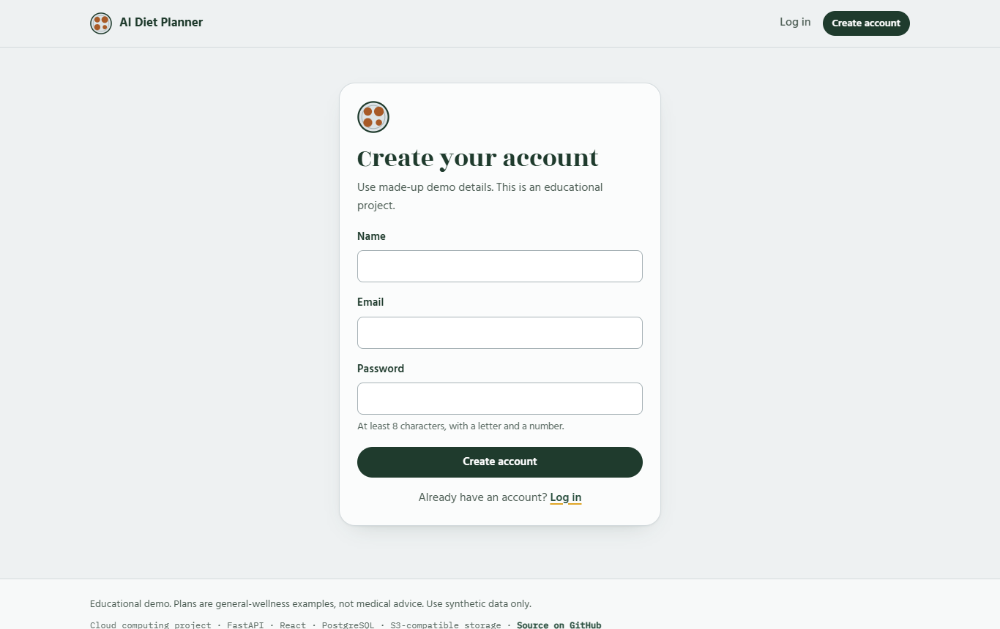 Register |
| 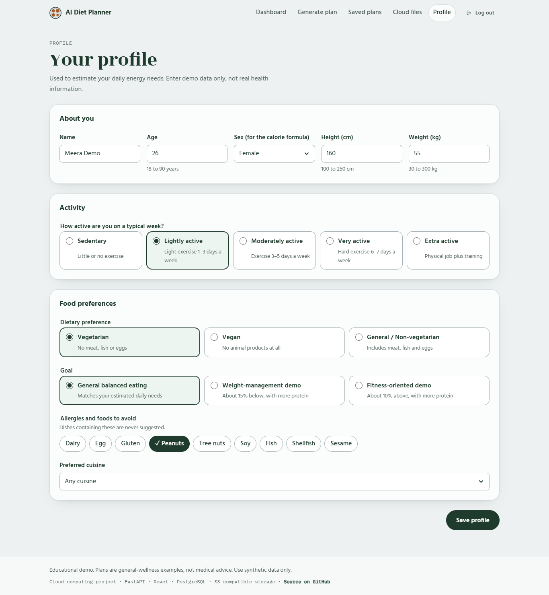 Profile | 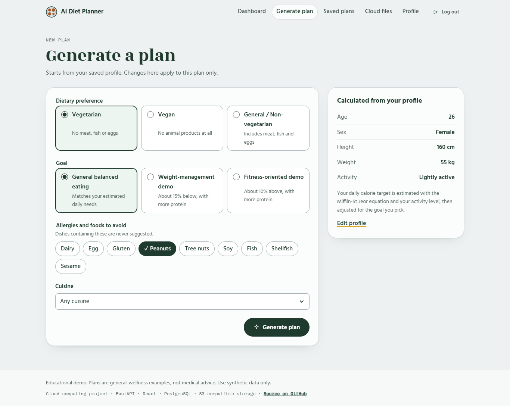 Generate a plan |
| 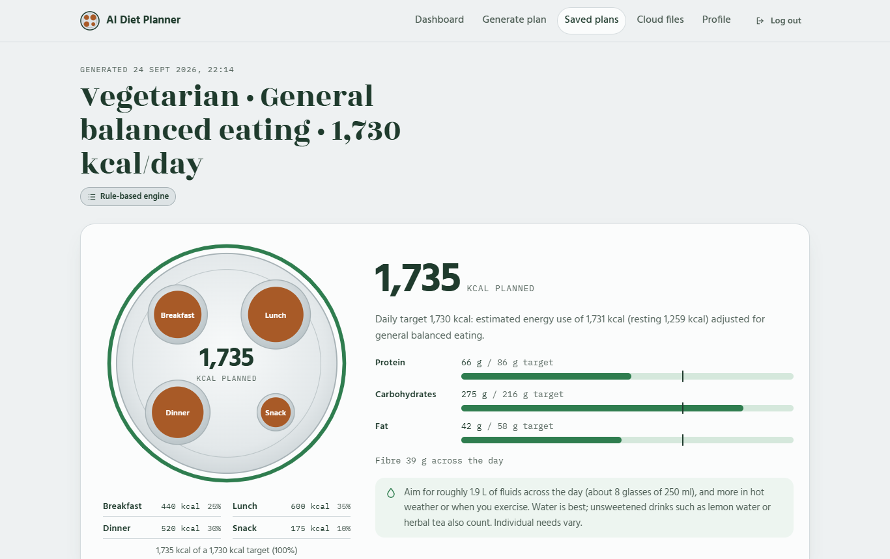 Plan result: thali, targets and meters | 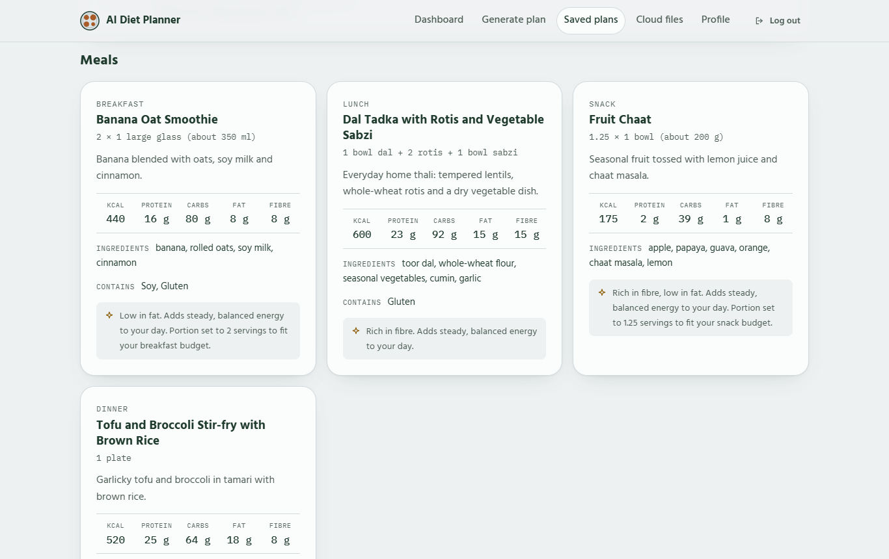 Meals with reasoning |
| 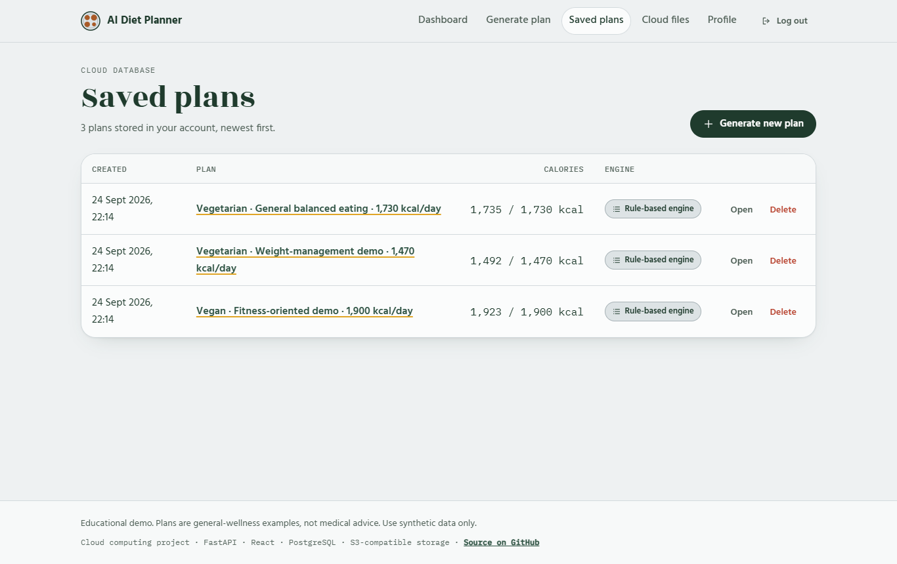 Saved plans | 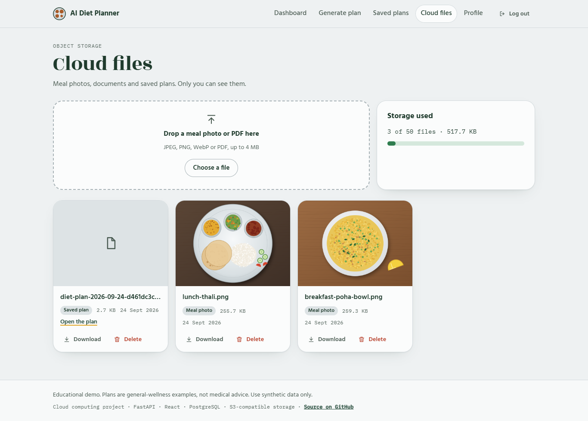 Cloud files (object storage) |
| 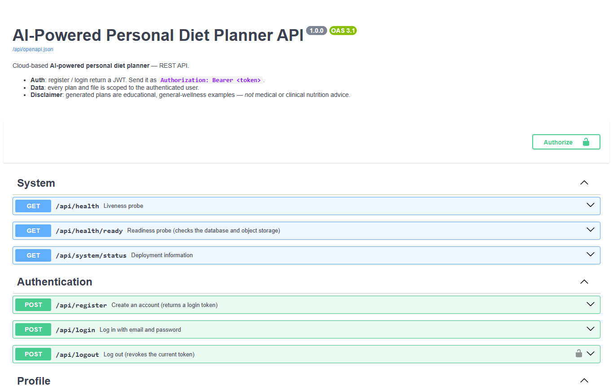 Swagger API docs | 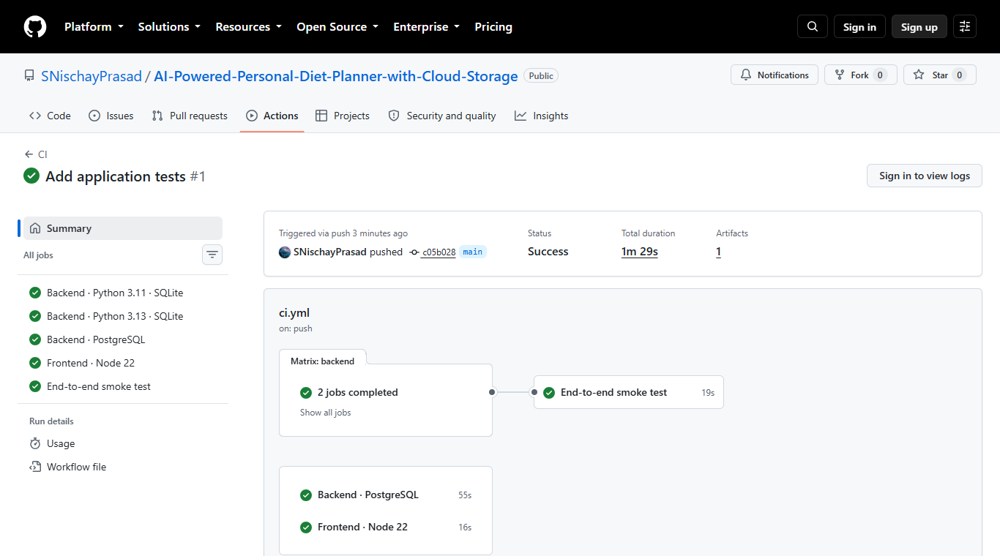 CI pipeline passing |

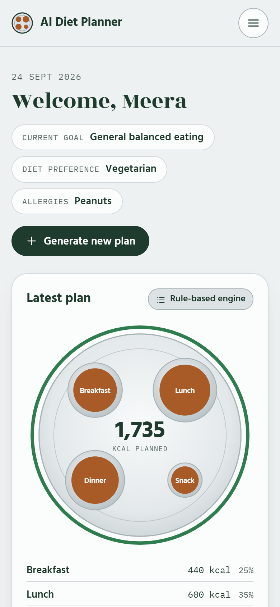

The screenshots are captured automatically from a running stack with synthetic data:
`python scripts/capture_screenshots.py`.

## Results

- A working full-stack cloud application: register → profile → personalised plan → saved to
  the cloud database → files in object storage → available from any device.
- **297** backend tests (97% statement coverage) and **31** frontend tests. The suite passes
  on SQLite and PostgreSQL, and the production Docker image passes a 28-check end-to-end
  smoke test in CI on its own and with PostgreSQL + S3 storage.
- The AI path never blocks the user: provider outages and invalid or unsafe answers fall back
  to the rule engine, and the plan says why.
- Sample outputs: [`sample_data/exports/`](sample_data/exports).

## Limitations

- Nutrition values are approximations from a 65-dish demo dataset; keyword-based allergen
  checks are a safety net, not a guarantee.
- The rate limiter is in memory, so limits apply per instance (use Redis when scaling out).
- Tables are created on start-up; a production system would use migrations (Alembic).
- Local storage mode keeps files on the server's disk. Use S3-compatible storage in the
  cloud.
- Free tiers sleep when idle, so the first request can take 30–60 s.
- The cloud deployment configs are CI-tested as a Docker image. The Render, Vercel and AWS
  steps follow provider documentation but were not run against a live account here.

## Future improvements

Alembic migrations · Redis for rate limits and caching · refresh tokens / managed identity
(Cognito, Supabase Auth) · presigned upload URLs · a queue and worker for AI generation ·
weekly plans and shopping lists · recipe images · internationalisation · Terraform for the
AWS architecture · OpenTelemetry tracing.

## Learning outcomes

Designing a stateless REST API; the difference between databases and object storage;
twelve-factor configuration and secrets management; authentication vs authorization and user
isolation; integrating an LLM safely (data minimisation, structured output, validation,
fallback); failure handling and health checks; containerisation; CI/CD with a real
database and a full-stack smoke test; and documenting a system for others.

## Disclaimer

This is an educational project. Generated plans are general-wellness examples, not medical
or clinical nutrition advice, and do not diagnose, treat or prevent any condition. Consult a
qualified healthcare professional or registered dietitian before changing your diet. All
users, profiles and images in this repository are synthetic.

## Author

**Sadhanala Nischay Prasad**, Cloud Computing course project ·
GitHub [@SNischayPrasad](https://github.com/SNischayPrasad)

Licensed under the [MIT License](LICENSE).
